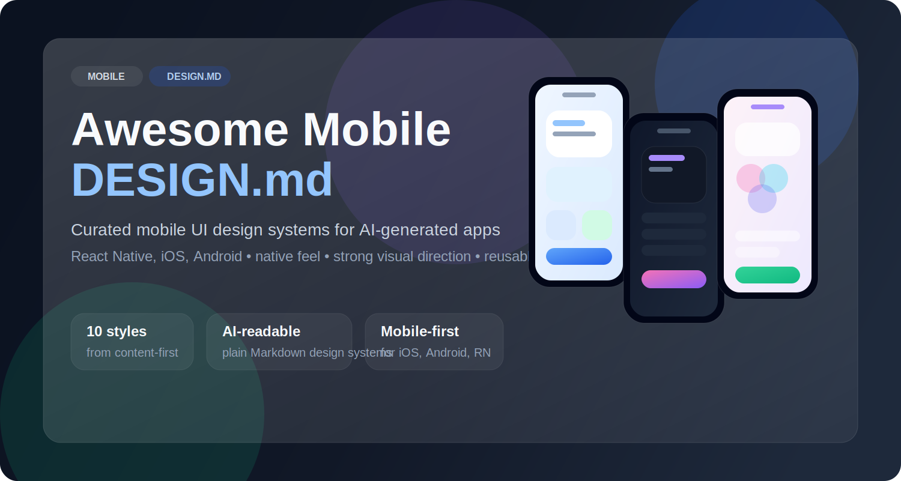

<a href="https://github.com/TrustOtc/awesome-mobile-design-md">
  
</a>

<div align="center">
  <strong>Curated collection of mobile-first DESIGN.md files for AI-generated UI.</strong>
  <br />
  <br />
</div>

<div align="center">

[](https://awesome.re)

[](https://github.com/TrustOtc/awesome-mobile-design-md)
[](https://github.com/TrustOtc/awesome-mobile-design-md/blob/main/LICENSE)

</div>

# Awesome Mobile DESIGN.md

Copy a mobile `DESIGN.md` into your project root, tell your AI agent which direction to follow, and get UI that feels intentional instead of generic.

This repository focuses on **mobile app design systems** for **React Native, iOS, and Android**. Each file is written in plain Markdown so AI coding agents can read it directly and generate screens, flows, and components with a consistent visual language.

## What is DESIGN.md?

[`DESIGN.md`](https://stitch.withgoogle.com/docs/design-md/overview/) is a design system document format introduced by Google Stitch. It gives AI agents a plain-text description of how an interface should look and behave.

No design tokens pipeline. No JSON schema. No Figma export step. Just a Markdown file that an LLM can read directly.

| File | Who reads it | What it defines |
|------|-------------|-----------------|
| `AGENTS.md` | Coding agents | How to build the project |
| `DESIGN.md` | Design-aware agents | How the product should look and feel |

This repo provides **ready-to-use mobile DESIGN.md files** covering different UI aesthetics and product categories.

## Why This Repo Exists

Most AI-generated mobile UI has the same failure mode:

- too generic
- no strong visual direction
- weak spacing and hierarchy
- inconsistent component styling
- unclear platform behavior

These `DESIGN.md` files solve that by giving your agent a concrete design language before it starts generating code.

## Collection

Each file below is a reusable mobile design direction. If you are not sure which one to use, start from the "Best for" column.

| File | Design style | Best for |
|------|--------------|----------|
| [`design-md/nova-mobile-design-md.md`](./design-md/nova-mobile-design-md.md) | Clean, balanced, native-feeling default mobile UI | General-purpose apps, MVPs, utilities, teams that want a safe default |
| [`design-md/soft-glass.md`](./design-md/soft-glass.md) | iOS-inspired glassmorphism, layered blur, premium softness | Premium consumer apps, lifestyle apps, polished onboarding, high-end product surfaces |
| [`design-md/material-clean.md`](./design-md/material-clean.md) | Material Design 3 inspired, structured and systematic | Android-first apps, cross-platform products, productivity tools, operational apps |
| [`design-md/playful-color.md`](./design-md/playful-color.md) | Vibrant, expressive, rounded, consumer-friendly | Social apps, habit apps, education, wellness, retention-oriented products |
| [`design-md/content-first.md`](./design-md/content-first.md) | Minimal, typography-led, distraction-free | Reading apps, writing tools, note-taking, newsletters, article-heavy products |
| [`design-md/card-heavy.md`](./design-md/card-heavy.md) | Modular card-first layout with strong section separation | Feeds, discovery, marketplaces, recommendations, browse-heavy experiences |
| [`design-md/midnight-pro.md`](./design-md/midnight-pro.md) | Dark-first, sharp, modern, slightly futuristic | Pro tools, creator apps, audio/video tools, power-user mobile products |
| [`design-md/data-dashboard.md`](./design-md/data-dashboard.md) | Dense, analytical, metric-led dashboard interface | Analytics, monitoring, finance, reporting, operational dashboards |
| [`design-md/enterprise-neutral.md`](./design-md/enterprise-neutral.md) | Professional, restrained, high-clarity enterprise UI | B2B apps, admin panels, approval flows, internal tools, productivity systems |
| [`design-md/minimal-brutalist.md`](./design-md/minimal-brutalist.md) | Hard-edged, black-and-white, rigid, no-decoration interface | Experimental products, utility tools, strong editorial identity, ultra-minimal experiences |

## Quick Chooser

Use this when you want to decide fast:

- Want the safest all-around default: [`nova-mobile-design-md.md`](./design-md/nova-mobile-design-md.md)
- Want premium iOS polish: [`soft-glass.md`](./design-md/soft-glass.md)
- Want Android / Material alignment: [`material-clean.md`](./design-md/material-clean.md)
- Want something colorful and lively: [`playful-color.md`](./design-md/playful-color.md)
- Want reading and writing to dominate: [`content-first.md`](./design-md/content-first.md)
- Want a card-based feed or marketplace: [`card-heavy.md`](./design-md/card-heavy.md)
- Want dark pro-tool energy: [`midnight-pro.md`](./design-md/midnight-pro.md)
- Want metrics and dashboards: [`data-dashboard.md`](./design-md/data-dashboard.md)
- Want enterprise clarity with low visual noise: [`enterprise-neutral.md`](./design-md/enterprise-neutral.md)
- Want a strict, stark, brutalist interface: [`minimal-brutalist.md`](./design-md/minimal-brutalist.md)

## What's Inside Each DESIGN.md

Every file follows a consistent mobile-oriented structure so agents can parse them reliably:

| # | Section | What it captures |
|---|---------|-----------------|
| 1 | Design Principles | Product mood, design philosophy, intended use cases |
| 2 | Color System | Light and dark palettes, semantic roles, visual rules |
| 3 | Typography | Font choices, type scale, readability rules |
| 4 | Spacing System | Spacing tokens and layout rhythm |
| 5 | Layout & Safe Area | Screen padding, mobile structure, safe-area behavior |
| 6 | Touch & Interaction | Touch targets, feedback patterns, motion expectations |
| 7 | Navigation Patterns | Tab, stack, modal, and flow conventions |
| 8 | Components | Buttons, cards, inputs, lists, and recurring UI primitives |
| 9 | Motion | Timing, transition style, animation personality |
| 10 | Elevation & Depth | Shadows, layering, surface hierarchy |
| 11 | Iconography | Icon style, stroke feel, sizing |
| 12 | Accessibility | Contrast, scaling, assistive behavior |
| 13 | Platform Adaptation | iOS vs Android adjustments |
| 14 | Do / Don't | Guardrails and anti-patterns |

## Repo Structure

| Path | Purpose |
|------|---------|
| [`design-md/`](./design-md/) | All reusable mobile design system documents |
| [`README.md`](./README.md) | Overview, selection guide, and usage instructions |
| [`CONTRIBUTING.md`](./CONTRIBUTING.md) | Rules for improving existing design files |

Preview files are part of the contribution workflow and should accompany a design style when visual token or component examples need to be demonstrated:

| File | Purpose |
|------|---------|
| `preview.html` | Light-mode visual catalog for colors, typography, buttons, cards, inputs, and spacing |
| `preview-dark.html` | Dark-mode visual catalog for the same design system surfaces and components |

## How to Use

1. Pick a file from [`design-md/`](./design-md/).
2. Copy it into your app root as `DESIGN.md`.
3. Tell your AI agent to follow that design system when building screens or components.

Example prompt:

```txt
Use the DESIGN.md in this repo root.
Build a mobile home screen that follows it closely.
Prioritize native spacing, typography, and component behavior.
```

## Contributing

See [`CONTRIBUTING.md`](./CONTRIBUTING.md) for the workflow.

- Improve existing files by fixing wrong colors, missing tokens, weak component guidance, or unclear descriptions
- Keep the structure consistent so agents can read every design file the same way
- Update or add `preview.html` and `preview-dark.html` when your design-token changes need visual verification

## License

MIT License. See [`LICENSE`](./LICENSE).

This repository contains original Markdown design system documents intended to guide AI-generated mobile UI. They are provided as-is, without warranty, for design reference and implementation guidance.
